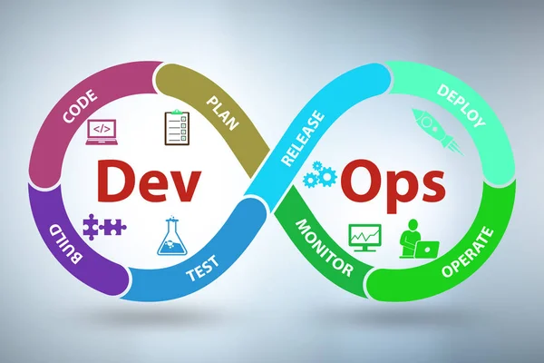

# Site do PedroJOK

**Site de informações**, estudos sobre TI e *muito mais*.

## Funcionalidades:

_Sobre meus estudos de DevOps._

### Estudos Atuais 

* Terraform
* Jenkins
* AWS
* Kubernetes
* Docker

### Proximos estudos

1. Python
2. Shell Script 
3. SQL
4. CI/CD

### Links de Referências de Estudos DevOps

[schoolofnet](https://www.schoolofnet.com/plano-de-estudo-infra-e-devops/)

